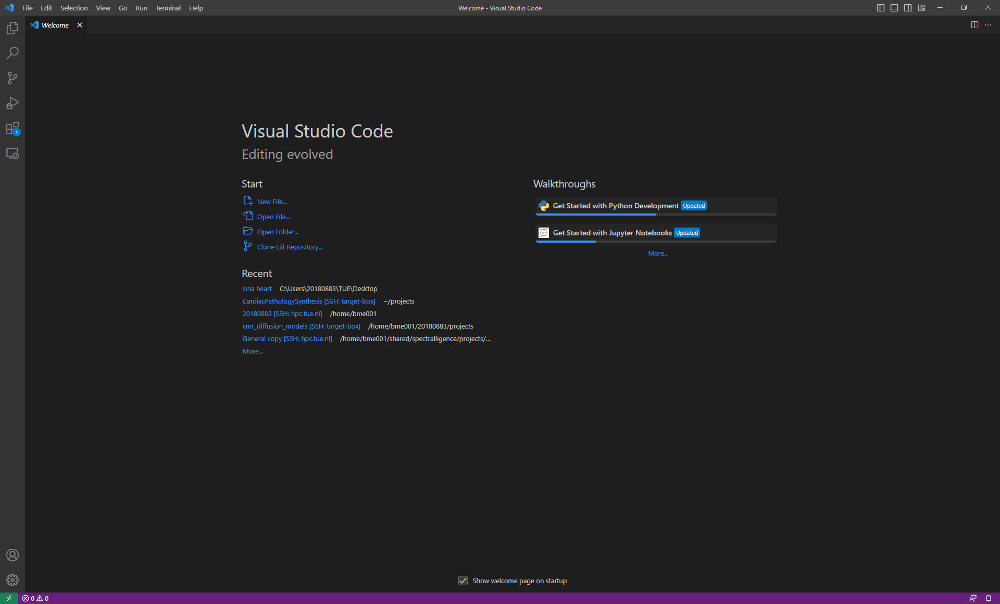

# Showcase session: VS Code
### Presenter: Sina Amirrajab
### Date: 06-04-2023
### Email: s.amirrajab@tue.nl

# VS Code demo

## Download and install VS Code, free and available for all platforms

- [https://code.visualstudio.com/](https://code.visualstudio.com/)
- introduction videos [https://code.visualstudio.com/docs/getstarted/introvideos](https://code.visualstudio.com/docs/getstarted/introvideos)

## **Getting Started with Python in VS Code**

[https://code.visualstudio.com/docs/python/python-tutorial](https://code.visualstudio.com/docs/python/python-tutorial)

## Install python extension to support python language

Along with the Python extension, you need to install a Python interpreter

**Using Python environments in VS Code:** [https://code.visualstudio.com/docs/python/environments](https://code.visualstudio.com/docs/python/environments)

## The basic layout of the VS Code interface

At its heart, Visual Studio Code is a code editor. Like many other code editors, VS Code adopts a common user interface and layout of an explorer on the left, showing all of the files and folders you have access to, and an editor on the right, showing the content of the files you have opened.

### Basic layout

- **Editor** - The main area to edit your files. You can open as many editors as you like side by side vertically and horizontally.
- **Side Bar** - Contains different views like the Explorer to assist you while working on your project.
- **Status Bar** - Information about the opened project and the files you edit.
- **Activity Bar** - Located on the far left-hand side, this lets you switch between views and gives you additional context-specific indicators, like the number of outgoing changes when Git is enabled.
- **Panels** - You can display different panels below the editor region for output or debug information, errors and warnings, or an integrated terminal. Panel can also be moved to the right for more vertical space.

## Hands-on: reproduce the results from this tutorial

 [https://scikit-learn.org/stable/auto_examples/manifold/plot_lle_digits.html#embedding-techniques-comparison](https://scikit-learn.org/stable/auto_examples/manifold/plot_lle_digits.html#embedding-techniques-comparison)

Jupiter notebook and interactive python #%%

## Debug code using the built-in debugger

[https://code.visualstudio.com/Docs/editor/debugging](https://code.visualstudio.com/Docs/editor/debugging)

## Manage source control and use Git with VS Code

[https://code.visualstudio.com/docs/sourcecontrol/overview](https://code.visualstudio.com/docs/sourcecontrol/overview)

## Connect to the server and develop your code remotely

[https://code.visualstudio.com/docs/remote/remote-overview](https://code.visualstudio.com/docs/remote/remote-overview)

## **AI Tools in VS Code,** [GitHub Copilot extension](https://marketplace.visualstudio.com/items?itemName=GitHub.copilot)

[https://code.visualstudio.com/docs/editor/artificial-intelligence](https://code.visualstudio.com/docs/editor/artificial-intelligence)
